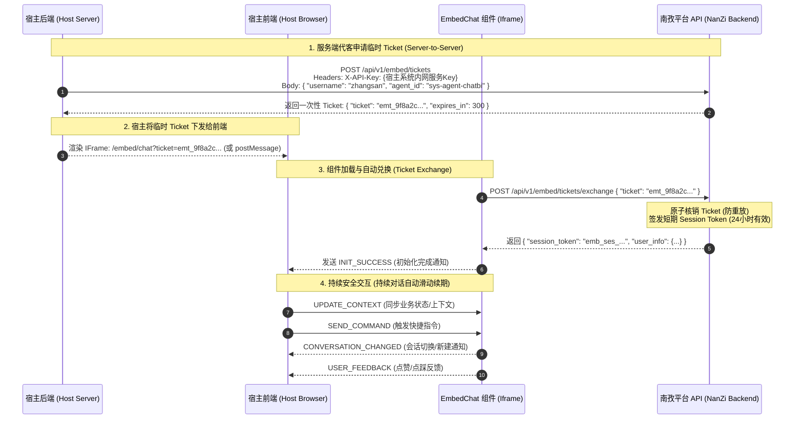

# NanZi智能体平台嵌入式组件集成指南 (EmbedChat Integration Guide)

本文档旨在指导第三方业务系统（如 OA 协同、CRM 客户管理、ERP 系统、运维监控、数据门户等）如何安全、高效、深度地集成南孜 AI Agent 对话组件（EmbedChat）。

---

## 目录 (Table of Contents)

1. [集成架构与认证原理](#一集成架构与认证原理)
2. [认证与凭证模式对比](#二认证与凭证模式对比)
3. [服务端 Ticket 签发接口规范](#三服务端-ticket-签发接口规范)
4. [多语言后端接入示例 (Java / Python / Go / Node.js / cURL)](#四多语言后端接入示例)
5. [多前端框架接入示例 (Vue 3 / React / 原生 HTML / 悬浮球)](#五多前端框架接入示例)
6. [双向通信协议 (PostMessage Protocol)](#六双向通信协议-postmessage-protocol)
7. [会话生命周期与滑动续期机制](#七会话生命周期与滑动续期机制)
8. [样式、主题与品牌定制 (Theming)](#八样式主题与品牌定制)
9. [常见问题与排错指南 (FAQ &amp; Troubleshooting)](#九常见问题与排错指南)

---

## 一、集成架构与认证原理

在企业级生产环境中，**强烈推荐使用 Embed Ticket 临时票据体系**。该架构实现了**长期主 API Key 零泄露**与**用户代客身份（Impersonation）安全绑定**。



---

## 二、认证与凭证模式对比

| 维度                    | ⭐ Embed Ticket 模式（生产推荐）                                                                 | API Key 直传模式（传统兼容）                                                 |
| ----------------------- | ------------------------------------------------------------------------------------------------ | ---------------------------------------------------------------------------- |
| **安全性**        | ⭐️⭐️⭐️⭐️⭐️**最高**。长期 Key 永不离开内网服务器，浏览器仅接触 5 分钟一次性票据。 | ⭐️⭐️**较低**。长期 Key 直接暴露在浏览器 URL 或 JavaScript 内存中。 |
| **防盗链/防重放** | **支持**。Ticket 兑换后立即原子删除（`GETDEL` 阅后即焚），他人无法盗用链接。             | **不支持**。复制 URL 即可被他人打开或长期利用。                        |
| **会话续期**      | **活跃滑动续期 (Sliding TTL)**。持续交互自动维持 24 小时有效时间，闲置自动释放。           | 永久有效（除非手动重置 Key）。                                               |
| **适用场景**      | 企业内网/外网生产系统、多租户门户、移动端 H5 嵌入。                                              | 本地 MVP 原型验证、内网快速临时调试。                                        |

> **补充：API Key 直传模式的现状**。直传模式仍完整支持，但 `?token=` 校验通过后，服务端会自动
> **换发一枚可过期的会话令牌**（`emb_ses_*`，24 小时滑动续期）并优先使用它——传入的长期 API Key
> **用后即弃**，不再写入浏览器任何持久化存储（含 `localStorage`），只在单次校验请求中出现。
> 同时，门户内嵌场景（平台自身 `Chat.vue` 的同源 iframe）已不再下发任何凭据，认证完全走
> HttpOnly Cookie。详见 [`portal_session_token_plan.md`](./portal_session_token_plan.md)。
>
> **凭据前缀一览**（便于在日志与抓包中区分）：主 API Key 为 `nzi_` + 43 字符随机体（共 47 字符）；
> Ticket 为 `emt_`；兑换或换发得到的嵌入会话令牌为 `emb_ses_`；门户会话令牌为 `sess_`。
> 主 API Key 的 `nzi_` 前缀是后加的，**此前签发的无前缀 Key 继续有效**——校验只做 SHA256 查库、
> 不解析格式，无需重新申请。

---

## 三、服务端 Ticket 签发接口规范

### 1. 签发 Ticket (Create Embed Ticket)

- **请求方式**：`POST /api/v1/embed/tickets`
- **请求头**：
  ```http
  Content-Type: application/json
  X-API-Key: <宿主系统的长期主 API Key>
  ```
- **请求参数 (JSON Body)**：

| 字段名              | 类型         | 必填 | 默认值          | 说明                                                                        |
| ------------------- | ------------ | ---- | --------------- | --------------------------------------------------------------------------- |
| `username`        | string       | 否   | 当前调用者      | 目标业务用户的用户名（代表哪个用户进行对话）。                              |
| `user_id`         | integer      | 否   | -               | 目标用户的 ID（与`username` 二选一）。                                    |
| `agent_id`        | string       | 否   | 内置通用助手    | 锁定对话的智能体 ID（如`sys-agent-chatbi`、`sys-agent-data`）。         |
| `allowed_origins` | list[string] | 否   | `[]` (不限制) | 限定允许嵌入该 Ticket 的前端域名列表（如`["https://crm.company.com"]`）。 |
| `expires_in`      | integer      | 否   | `300`         | Ticket 兑换有效时长（秒），取值范围 60 ~ 1800 秒。                          |

- **响应格式 (JSON)**：
  ```json
  {
    "code": 200,
    "message": "success",
    "data": {
      "ticket": "emt_a8f9c2d1e0b3456789abcdef",
      "expires_in": 300,
      "target_user": {
        "user_id": 102,
        "user_name": "zhangsan",
        "real_name": "张三"
      }
    }
  }
  ```

---

## 四、多语言后端接入示例

### 1. Java (Spring Boot) 示例

```java
import org.springframework.beans.factory.annotation.Value;
import org.springframework.http.*;
import org.springframework.web.bind.annotation.*;
import org.springframework.web.client.RestTemplate;
import java.util.*;

@RestController
@RequestMapping("/api/ai")
public class AiEmbedController {

    @Value("${nanzi.api.url:https://nanzi-ai.yourcompany.com}")
    private String nanziApiUrl;

    @Value("${nanzi.api.key}")
    private String nanziApiKey;

    private final RestTemplate restTemplate = new RestTemplate();

    @GetMapping("/embed-ticket")
    public ResponseEntity<?> getEmbedTicket(@RequestAttribute("currentUser") String currentUsername) {
        String url = nanziApiUrl + "/api/v1/embed/tickets";

        HttpHeaders headers = new HttpHeaders();
        headers.setContentType(MediaType.APPLICATION_JSON);
        headers.set("X-API-Key", nanziApiKey);

        Map<String, Object> body = new HashMap<>();
        body.put("username", currentUsername);
        body.put("agent_id", "sys-agent-chatbi");
        body.put("expires_in", 300);

        HttpEntity<Map<String, Object>> request = new HttpEntity<>(body, headers);
        ResponseEntity<Map> response = restTemplate.postForEntity(url, request, Map.class);

        if (response.getStatusCode().is2xxSuccessful() && response.getBody() != null) {
            Map data = (Map) response.getBody().get("data");
            return ResponseEntity.ok(Collections.singletonMap("ticket", data.get("ticket")));
        }
        return ResponseEntity.status(HttpStatus.INTERNAL_SERVER_ERROR).body("Failed to issue ticket");
    }
}
```

### 2. Python (FastAPI / Requests) 示例

```python
import os
import httpx
from fastapi import APIRouter, Depends, HTTPException

router = APIRouter(prefix="/api/ai")

NANZI_API_URL = os.getenv("NANZI_API_URL", "https://nanzi-ai.yourcompany.com")
NANZI_API_KEY = os.getenv("NANZI_SYSTEM_API_KEY")

@router.get("/embed-ticket")
async def get_ai_embed_ticket(current_username: str = "zhangsan"):
    async with httpx.AsyncClient(timeout=10.0) as client:
        resp = await client.post(
            f"{NANZI_API_URL}/api/v1/embed/tickets",
            headers={"X-API-Key": NANZI_API_KEY},
            json={
                "username": current_username,
                "agent_id": "sys-agent-chatbi",
                "expires_in": 300
            }
        )
        if resp.status_code != 200:
            raise HTTPException(status_code=500, detail="Failed to issue embed ticket")
      
        data = resp.json()
        return {"ticket": data["data"]["ticket"]}
```

### 3. Go (Gin) 示例

```go
package main

import (
	"bytes"
	"encoding/json"
	"net/http"
	"os"
	"github.com/gin-gonic/gin"
)

func GetEmbedTicketHandler(c *gin.Context) {
	currentUsername := c.GetString("username") // 宿主登录用户
	nanziUrl := os.Getenv("NANZI_API_URL")
	apiKey := os.Getenv("NANZI_API_KEY")

	reqBody, _ := json.Marshal(map[string]interface{}{
		"username":   currentUsername,
		"agent_id":   "sys-agent-chatbi",
		"expires_in": 300,
	})

	req, _ := http.NewRequest("POST", nanziUrl+"/api/v1/embed/tickets", bytes.NewBuffer(reqBody))
	req.Header.Set("Content-Type", "application/json")
	req.Header.Set("X-API-Key", apiKey)

	resp, err := http.DefaultClient.Do(req)
	if err != nil || resp.StatusCode != http.StatusOK {
		c.JSON(http.StatusInternalServerError, gin.H{"error": "Failed to create ticket"})
		return
	}
	defer resp.Body.Close()

	var result struct {
		Data struct {
			Ticket string `json:"ticket"`
		} `json:"data"`
	}
	json.NewDecoder(resp.Body).Decode(&result)
	c.JSON(http.StatusOK, gin.H{"ticket": result.Data.Ticket})
}
```

### 4. cURL 示例

```bash
curl -X POST "https://nanzi-ai.yourcompany.com/api/v1/embed/tickets" \
     -H "Content-Type: application/json" \
     -H "X-API-Key: sk-your-system-service-key" \
     -d '{
       "username": "zhangsan",
       "agent_id": "sys-agent-chatbi",
       "expires_in": 300
     }'
```

---

## 五、多前端框架接入示例

### 1. Vue 3 接入示例 (带超时静默重连)

```vue
<template>
  <div class="ai-widget-container">
    <iframe
      ref="widgetFrame"
      :src="frameUrl"
      class="w-full h-full border-none rounded-xl"
      allow="clipboard-write"
    />
  </div>
</template>

<script setup lang="ts">
import { ref, onMounted, onUnmounted } from 'vue';
import axios from 'axios';

const widgetFrame = ref<HTMLIFrameElement | null>(null);
const frameUrl = ref('');

// 1. 获取 Ticket 并加载 IFrame
const fetchTicketAndLoad = async () => {
  try {
    const res = await axios.get('/api/ai/embed-ticket');
    const ticket = res.data.ticket;
    frameUrl.value = `https://nanzi-ai.yourcompany.com/embed/chat?ticket=${encodeURIComponent(ticket)}&theme=light`;
  } catch (err) {
    console.error('Failed to load AI widget:', err);
  }
};

// 2. 监听 IFrame 双向通信
const handleMessage = async (event: MessageEvent) => {
  const data = event.data;
  if (data?.source !== 'nanzi-agent-embed') return;

  switch (data.type) {
    case 'INIT_SUCCESS':
      console.log('南孜智能体就绪');
      break;

    case 'INIT_FAILURE':
      // 3. 处理会话超时：静默申请新 Ticket 并发送重连指令
      if (data.reason === 'invalid_ticket' || data.reason === 'invalid_token') {
        console.warn('会话超时，正在静默续签...');
        const res = await axios.get('/api/ai/embed-ticket');
        widgetFrame.value?.contentWindow?.postMessage({
          type: 'RESET_SESSION',
          ticket: res.data.ticket
        }, '*');
      }
      break;

    case 'USER_FEEDBACK':
      console.log('用户评价反馈:', data.feedback, 'Trace ID:', data.trace_id);
      break;
  }
};

onMounted(() => {
  window.addEventListener('message', handleMessage);
  fetchTicketAndLoad();
});

onUnmounted(() => {
  window.removeEventListener('message', handleMessage);
});
</script>

<style scoped>
.ai-widget-container {
  width: 100%;
  height: 680px;
}
</style>
```

### 2. React 接入示例

```tsx
import React, { useEffect, useRef, useState } from 'react';

export const NanZiAiChat: React.FC = () => {
  const frameRef = useRef<HTMLIFrameElement>(null);
  const [iframeSrc, setIframeSrc] = useState<string>('');

  const loadTicket = async () => {
    try {
      const resp = await fetch('/api/ai/embed-ticket');
      const { ticket } = await resp.json();
      setIframeSrc(`https://nanzi-ai.yourcompany.com/embed/chat?ticket=${ticket}&theme=light`);
    } catch (e) {
      console.error('Failed to get ticket', e);
    }
  };

  useEffect(() => {
    loadTicket();

    const onMessage = async (event: MessageEvent) => {
      const data = event.data;
      if (data?.source !== 'nanzi-agent-embed') return;

      if (data.type === 'INIT_FAILURE' && (data.reason === 'invalid_ticket' || data.reason === 'invalid_token')) {
        const resp = await fetch('/api/ai/embed-ticket');
        const { ticket } = await resp.json();
        frameRef.current?.contentWindow?.postMessage({
          type: 'RESET_SESSION',
          ticket
        }, '*');
      }
    };

    window.addEventListener('message', onMessage);
    return () => window.removeEventListener('message', onMessage);
  }, []);

  return (
    <iframe
      ref={frameRef}
      src={iframeSrc}
      style={{ width: '100%', height: '650px', border: 'none', borderRadius: '12px' }}
      title="NanZi AI Agent"
    />
  );
};
```

### 3. 右下角悬浮球与抽屉展开模式 (Floating Widget)

```html
<!-- 悬浮助手 DOM 结构 -->
<div id="nanzi-floating-shell" class="nanzi-floating-shell collapsed">
  <button id="nanzi-floating-btn" class="nanzi-btn">💬 AI 助手</button>
  <button id="nanzi-close-btn" class="nanzi-close" title="收起">×</button>
  <iframe id="nanzi-frame" src="about:blank"></iframe>
</div>

<style>
.nanzi-floating-shell {
  position: fixed;
  right: 24px;
  bottom: 24px;
  z-index: 99999;
  width: 420px;
  height: 680px;
  box-shadow: 0 16px 40px rgba(0,0,0,0.18);
  border-radius: 16px;
  overflow: hidden;
  transition: all 0.3s cubic-bezier(0.4, 0, 0.2, 1);
  background: #ffffff;
}
.nanzi-floating-shell.collapsed {
  width: 52px;
  height: 52px;
  border-radius: 999px;
  box-shadow: 0 8px 24px rgba(0,0,0,0.12);
}
.nanzi-floating-shell.collapsed iframe,
.nanzi-floating-shell.collapsed #nanzi-close-btn { display: none; }
.nanzi-floating-shell iframe { width: 100%; height: 100%; border: none; }
.nanzi-btn { width: 100%; height: 100%; background: #1677ff; color: #fff; border: none; cursor: pointer; border-radius: 999px; }
.nanzi-floating-shell:not(.collapsed) .nanzi-btn { display: none; }
.nanzi-close { position: absolute; top: 12px; right: 12px; background: rgba(0,0,0,0.06); border: none; border-radius: 50%; width: 28px; height: 28px; cursor: pointer; z-index: 10; font-size: 18px; }
</style>

<script>
const shell = document.getElementById('nanzi-floating-shell');
const frame = document.getElementById('nanzi-frame');
let isLoaded = false;

document.getElementById('nanzi-floating-btn').onclick = async () => {
  shell.classList.remove('collapsed');
  if (!isLoaded) {
    const res = await fetch('/api/ai/embed-ticket').then(r => r.json());
    frame.src = `https://nanzi-ai.yourcompany.com/embed/chat?ticket=${res.ticket}`;
    isLoaded = true;
  }
};
document.getElementById('nanzi-close-btn').onclick = () => {
  shell.classList.add('collapsed');
};
</script>
```

---

## 六、双向通信协议 (PostMessage Protocol)

### 1. 协议规范

- **组件发出的消息**：固定包含 `{ source: "nanzi-agent-embed" }`；
- **宿主发出的消息**：支持传递 `instance_id` 用于多实例隔离。

### 2. 下行指令集 (Host -> Widget)

| 指令类型 (Type)     | 参数结构                                                     | 说明                                                                          |
| ------------------- | ------------------------------------------------------------ | ----------------------------------------------------------------------------- |
| `INIT_CONFIG`     | `{ ticket, agent_id, theme, business_context, styleVars }` | **初始化指令**。优先传 `ticket`（推荐），支持注入业务上下文与品牌色。 |
| `RESET_SESSION`   | `{ ticket }` (推荐) 或 `{ new_token }`                   | **重置会话/超时续期**。当旧会话过期时，宿主传入新 Ticket 实现静默重连。 |
| `UPDATE_CONTEXT`  | `{ payload: { ... } }`                                     | 动态更新宿主业务上下文（如同步用户当前选中的订单号、设备 ID）。               |
| `SYNC_STATE`      | `{ payload: { ... } }`                                     | 同步宿主页面状态，效果同`UPDATE_CONTEXT`。                                  |
| `SET_THEME`       | `{ theme: 'light'\|'dark', styleVars: { ... } }`            | 动态切换亮暗模式或更新主色调。                                                |
| `STOP_GENERATION` | `{}`                                                       | 强制打断 AI 正在进行的流式生成。                                              |
| `CLEAR_SESSION`   | `{}`                                                       | 清空当前对话界面，开启新会话。                                                |
| `SEND_COMMAND`    | `{ command: '/new' }`                                      | 触发组件内置指令。                                                            |

### 3. 上行事件集 (Widget -> Host)

| 事件类型 (Type)           | 关键参数                                                             | 说明                                                             |
| ------------------------- | -------------------------------------------------------------------- | ---------------------------------------------------------------- |
| `NANZI_WIDGET_READY`    | `{}`                                                               | 组件 DOM 与 JavaScript 已完成加载，等待宿主发送`INIT_CONFIG`。 |
| `INIT_SUCCESS`          | `{}`                                                               | 组件已成功完成鉴权与智能体初始化，用户可开始对话。               |
| `INIT_FAILURE`          | `{ reason: "invalid_ticket" \| "missing_token" \| "invalid_token" }` | 鉴权失败或会话超时通知。                                         |
| `GENERATION_STOPPED`    | `{}`                                                               | 确认 AI 回复生成已成功中断。                                     |
| `CONVERSATION_CHANGED`  | `{ conversation_id, clear_host_conversation_pin }`                 | 会话发生切换或重置时通知宿主。                                   |
| `USER_FEEDBACK`         | `{ message_id, trace_id, feedback: "up" \| "down" \| null }`         | 用户点击点赞、点踩或取消反馈时触发。                             |
| `OPEN_DATA_PORTAL_FULL` | `{}`                                                               | 用户点击数据门户卡片，请求宿主跳转至完整门户大屏。               |

---

## 七、会话生命周期与滑动续期机制

### 1. 生命周期状态机

```
[宿主后端] 签发 Ticket (TTL=5分钟)
      │
      ▼ (下发给前端)
[IFrame] 调用 exchange 兑换
      │
      ├─▶ [成功] Ticket 立即原子销毁 (GETDEL) ──▶ 生成 Session Token (初始 TTL=24小时)
      │                                                │
      │                                                ▼ (用户发送消息/持续交互)
      │                                       【每次请求自动拉满 24小时 TTL】
      │                                                │
      │                                                ▼ (用户闲置挂机超 24小时)
      │                                        Session Token 自然失效
      │                                                │
      └─▶ [失效/超时] 触发 INIT_FAILURE ◀──────────────┘
              │
              ▼
    宿主前端重新向宿主后端申请新 Ticket
              │
              ▼
    发送 RESET_SESSION { ticket } ──▶ 无感重连成功！
```

---

## 八、样式、主题与品牌定制

通过在 `INIT_CONFIG` 或 `SET_THEME` 中传入 `styleVars`，您可以无缝将 EmbedChat 融入宿主系统的品牌色系：

```javascript
frame.contentWindow.postMessage({
  type: 'SET_THEME',
  theme: 'light', // 'light' | 'dark'
  styleVars: {
    '--primary-color': '#10b981',        // 品牌主强调色 (绿色)
    '--primary-hover': '#059669',        // 悬浮色
    '--primary-active': '#047857',       // 激活色
  }
}, '*');
```

---

## 九、常见问题与排错指南 (FAQ & Troubleshooting)

### Q1: 为什么我的 Ticket 只能兑换一次，刷新网页后报 `invalid_ticket`？

- **解答**：Ticket 设计为**一次性票据（One-Time Token）**。为了杜绝链接外泄或被盗用，IFrame 在首次兑换成功后服务端会立即核销该 Ticket。
- **解决方案**：前端每次重新加载或刷新页面时，应通过宿主后端接口重新申请一张崭新的 Ticket。

### Q2: 宿主后端调用 `/api/v1/embed/tickets` 报 `403 Forbidden`？

- **解答**：若在请求体中指定了其他用户的 `username` 或 `user_id` 进行代客签发（Impersonation），调用方必须具备代客权限。
- **解决方案**：请确保调用该接口的服务账号具备管理员权限（`admin`），或在【角色管理 → API 权限】中为其分配 `POST:/api/v1/embed/tickets`（代他人签发嵌入凭证）权限。普通用户若未获授权只能为自身签发 Ticket。
  > 早期版本该能力借用的是 `GET:/api/v1/users/profile`（获取用户信息）权限，现已改用上述专用权限码；若此前依赖旧权限，请重新分配。

### Q3: 报错 `404 Target user not found`？

- **解答**：传给 `username` 的用户在南孜平台尚不存在。
- **解决方案**：南孜平台需提前同步该用户账号，或在创建 Ticket 前先通过用户管理接口确保账号已创建。

### Q4: 移动端 H5 嵌入时如何防止横向滚动？

- **解答**：建议在宿主页面将 IFrame 容器设置为固定铺满：
  ```html
  <div style="position: fixed; inset: 0; width: 100vw; height: 100vh; overflow: hidden;">
    <iframe src="..." style="width: 100%; height: 100%; border: none;"></iframe>
  </div>
  ```
